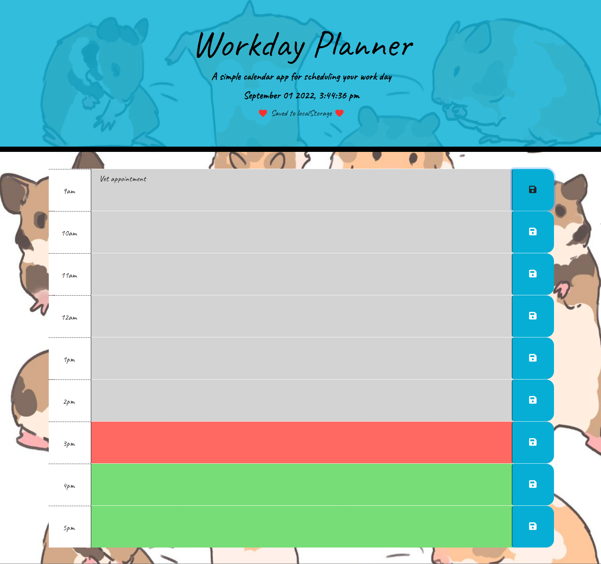

# Workday Planner

## 05 Project Tracker

GOAL: Use jQuery Bootstrap, and Moment, and Google Fonts to create a planner that features dynamically updated HTML and CSS.

Actions:
- created Repo and saved starter code
- added the updating date and time component to jumbotron in js file
- figured out how I could make the hour blocks look like the example in html file
- added code to save user input to local storage
- added code to get the planner to show past, present, and future color coding
- added timer to saveAlert
- fixed bugs that arose while chaning apearance of planner

## DEMO

<figure>
  
  <figcaption>Planner at 3pm after saving a an appointment</figcaption>
</figure>

<a href = "https://kosmonaut3173.github.io/Workday-Planner/" target = "_blank" rel="noopener noreferrer">LINK TO PLANNER</a>

## Credits

thank you @delicourseart (owner of the background image) for being an awesome artist

## License
MIT License

Copyright (c) 2022 Kosmonaut3173

Permission is hereby granted, free of charge, to any person obtaining a copy
of this software and associated documentation files (the "Software"), to deal
in the Software without restriction, including without limitation the rights
to use, copy, modify, merge, publish, distribute, sublicense, and/or sell
copies of the Software, and to permit persons to whom the Software is
furnished to do so, subject to the following conditions:

The above copyright notice and this permission notice shall be included in all
copies or substantial portions of the Software.

THE SOFTWARE IS PROVIDED "AS IS", WITHOUT WARRANTY OF ANY KIND, EXPRESS OR
IMPLIED, INCLUDING BUT NOT LIMITED TO THE WARRANTIES OF MERCHANTABILITY,
FITNESS FOR A PARTICULAR PURPOSE AND NONINFRINGEMENT. IN NO EVENT SHALL THE
AUTHORS OR COPYRIGHT HOLDERS BE LIABLE FOR ANY CLAIM, DAMAGES OR OTHER
LIABILITY, WHETHER IN AN ACTION OF CONTRACT, TORT OR OTHERWISE, ARISING FROM,
OUT OF OR IN CONNECTION WITH THE SOFTWARE OR THE USE OR OTHER DEALINGS IN THE
SOFTWARE.
